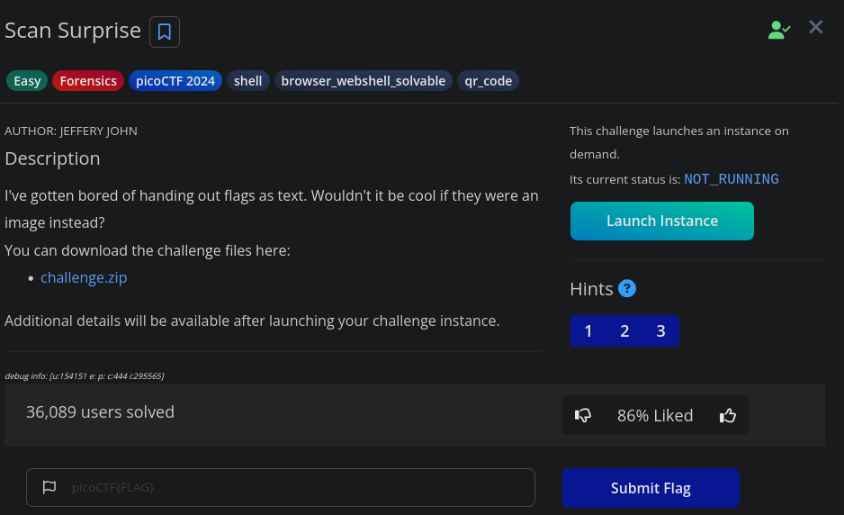
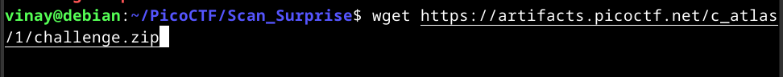
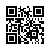
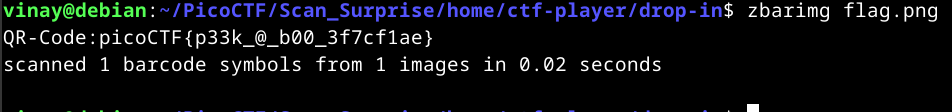

# Scan Surprise
---------------------------

-------------------------------
> This challenge is fairly a easy one as you can simply scan this image from phone or any software from computer and you get the flag 
--------------------------------------------

## Downloading the files:
------------------------------------------
```bash
wget https://artifacts.picoctf.net/c_atlas/1/challenge.zip
```
------------------------------------------

---------------------------------

We get to see that upon unzipping that, we get a flag.png which is just a qr code.


-----------------------------

We get the flag here itself by just scanning this image through phone, but I found a command line utility which can decode, **zbarcam**(to qr scan from camera) and **zbarimg**(scan qr from file), which is a part of zbar-tools.

To install it, for debian and debian-based systems:
```bash
sudo apt-get install zbar-tools -y
```
for arch based distributions:
```bash
sudo pacman -S zbar
```

after that we can decode qr code as follows:
```bash
zbarimg flag.png
```
-------------------------------


That's it, we have completed this challenge, Although it wasn't challenging enough, we got a chance to learn about command line tool for qr codes, (I recommend using command line for every purpose as possible as it provides efficiency).


Thank you for reading this blog, Hope you learned something...