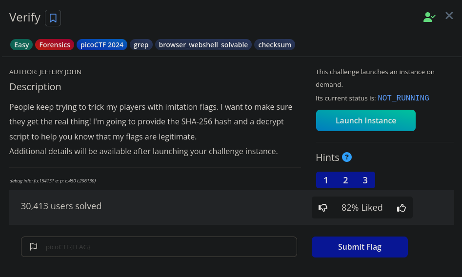
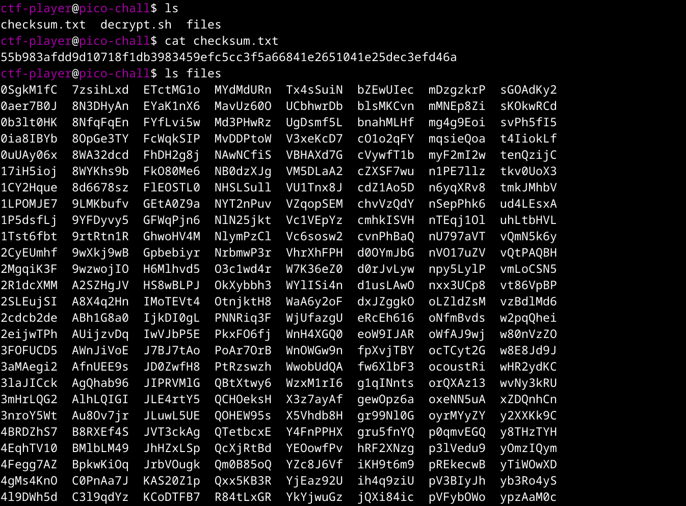
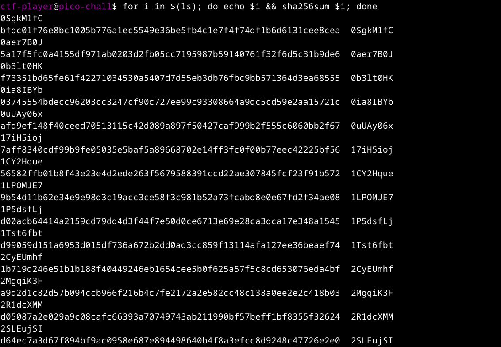
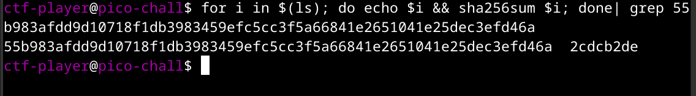
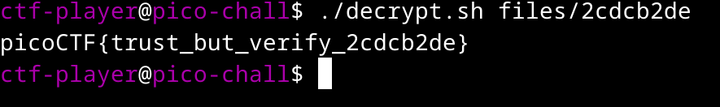

# Verify - PicoCTF Writeup
------------------------------------


---------------------------

>This challenge description is simply saying that we have to find the legit file from bunch of crap ones which contain actual flag and further can be decrypted. (I know it doesn't make sense, for now bare with me.)

The challenge also provides a ssh credentials so we can access the challenge, simply click on **Launch Instance**.

After launching the instance, description provides us the ssh credentials to login, let's do that.

```bash
ssh -p <random_port> ctf-player@rhea.picoctf.net
```
-------------------------------------------

-----------------------------------

Contents of decrypt.sh
```bash
#!/bin/bash

        # Check if the user provided a file name as an argument
        if [ $# -eq 0 ]; then
            echo "Expected usage: decrypt.sh <filename>"
            exit 1
        fi

        # Store the provided filename in a variable
        file_name="$1"

        # Check if the provided argument is a file and not a folder
        if [ ! -f "/home/ctf-player/drop-in/$file_name" ]; then
            echo "Error: '$file_name' is not a valid file. Look inside the 'files' folder with 'ls -R'!"
            exit 1
        fi

        # If there's an error reading the file, print an error message
        if ! openssl enc -d -aes-256-cbc -pbkdf2 -iter 100000 -salt -in "/home/ctf-player/drop-in/$file_name" -k picoCTF; then
            echo "Error: Failed to decrypt '$file_name'. This flag is fake! Keep looking!"
        fi
```

It takes a file as input, if it is a legit one, prints the flag by decrypting the file.

--------------------------------------
## Solution

Let's complete this challenge.
Mind you, Our goal is to find the file with checksum **55b983afdd9d10718f1db3983459efc5cc3f5a66841e2651041e25dec3efd46a** (sha256sum) under files directory.

> Using for loop,
By using for loop, we can iterate through all the files under files directory.
```bash
for i in $(ls files); do echo $i; done
```
This command, for every i in output of ls command, echoes (prints) the value i, which is the output of ls command.
This may look stupid, why on earth would you do that, you can just execute `ls` command right?

Yes, but you will get the point later in the writeup.

```bash
cd files
for i in $(ls); do echo $i && sha256sum $i; done
```

This command prints sha256sum and name of the file in one line, like this


------------------------------

Now, we have to just look for that checksum and the file name will be printed next to it.

We will pipe the same command to grep to match that expression.
```bash
for i in $(ls); do echo $i && sha256sum $i; done| grep 55b983afdd9d10718f1db3983459efc5cc3f5a66841e2651041e25dec3efd46a
```


-------------------------------
> We get the answer that the file **2cdcb2de** has sha256 checksum of **55b983afdd9d10718f1db3983459efc5cc3f5a66841e2651041e25dec3efd46a**

So, Let's get our flag.
```bash
cd ..
./decrypt.sh files/2cdcb2de
```
------------------------------------

-------------------------------

Thank you for reading my writeup, hope you got the solution and information about using for loop in bash.

